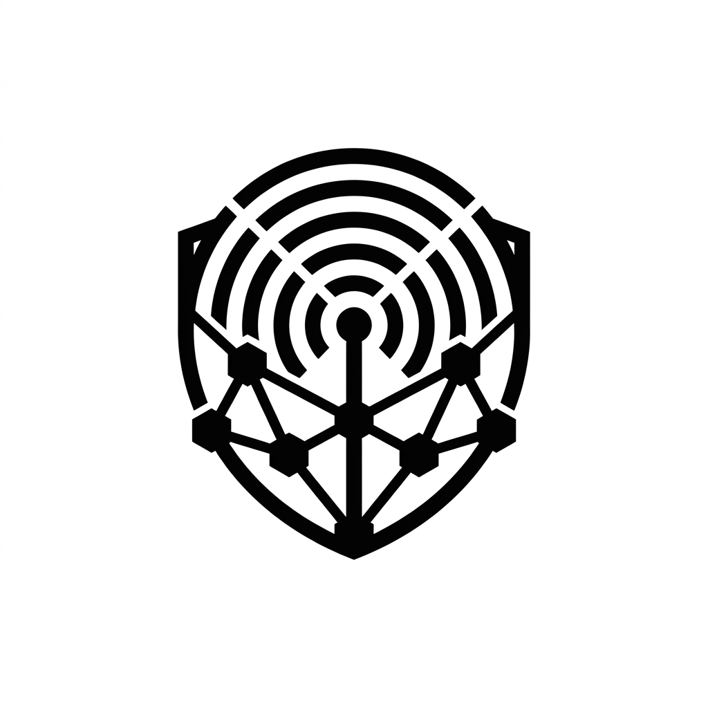

<div align="center">
  <br />
  
  <br />
  <h1>🚨 P.A.T.R.O.L.</h1>
  <p><strong>Peer-to-peer Aid, Tracking, & Remote Offline Link</strong></p>
  <p><i>Decentralized, zero-infrastructure disaster coordination mesh for Android over connectionless BLE gossip.</i></p>

  <br />

  <div>
    <a href="https://lazyshrey.com"></a>
    <a href="https://discord.com/invite/ZVCB8EnRX2"></a>
    
    
    
    <a href="LICENSE"></a>
  </div>

  <br />

  <p>
    <a href="#about">About</a> •
    <a href="#how-it-works">How It Works</a> •
    <a href="#wire-packet">Wire Packet</a> •
    <a href="#app-screens">Screens</a> •
    <a href="#quick-start">Quick Start</a> •
    <a href="#field-testing">Testing</a> •
    <a href="#deliberately-not-done">Limitations</a>
  </p>
</div>

---

## About

**P.A.T.R.O.L.** is an offline-first disaster coordination mesh for the first 72 hours of an emergency when cellular networks, power grids, and internet infrastructure fail.

Phones communicate directly with each other via **connectionless Bluetooth Low Energy (BLE) advertisements**—passing distress signals, triage statuses, and casualty counts hop-by-hop across devices without servers, internet, or accounts.

<br />

<div align="center">
  <table border="0" cellspacing="0" cellpadding="16">
    <tr>
      <td width="300" valign="top" style="border: 1px solid #333; border-radius: 12px; background: rgba(255,255,255,0.03);">
        <h3>📡 Connectionless BLE</h3>
        <p>No pairing popups or GATT connection limits. 20-byte raw frames broadcast to all nearby phones simultaneously.</p>
      </td>
      <td width="300" valign="top" style="border: 1px solid #333; border-radius: 12px; background: rgba(255,255,255,0.03);">
        <h3>🔄 7-Hop Relay Mesh</h3>
        <p>Controlled epidemic gossip automatically relays urgent reports across intermediate nodes to reach rescue teams.</p>
      </td>
    </tr>
    <tr>
      <td width="300" valign="top" style="border: 1px solid #333; border-radius: 12px; background: rgba(255,255,255,0.03);">
        <h3>📐 GPS-Free Localization</h3>
        <p>Estimates positions of victims trapped in basements or rubble without GPS using multi-peer RSSI observations.</p>
      </td>
      <td width="300" valign="top" style="border: 1px solid #333; border-radius: 12px; background: rgba(255,255,255,0.03);">
        <h3>🔁 Backward Status Flow</h3>
        <p>Dispatch updates ("Help on the way") travel backward across the mesh to notify the original reporter.</p>
      </td>
    </tr>
  </table>
</div>

<br />

---

## How It Works

- **Connectionless (1-to-N)**: Continuous raw advertising and scanning. Reaches every phone in radio range at once, avoiding Android's ~7 GATT connection limit and all pairing prompts.
- **Monotonic CRDT Status**: Merging is `Math.max(local, remote)` across `Reported < Acknowledged < In Progress < Resolved`. A resolved incident can never regress.
- **Echo Delivery Receipts**: When a peer relays your packet, it re-broadcasts with `hops > 0`. Hearing your own packet ID with `hops > 0` confirms the mesh picked it up.
- **Spatial Deduplication**: Geohash6 + Haversine ($\le 150\text{ m}$) clustering collapses duplicate bystander reports into a single incident with confirmation counts.

---

## Wire Packet (`PATROL/1`)

Every packet is a compact **20-byte binary frame** (big-endian) that fits inside a single standard BLE advertisement:

| Off | Size | Field | Description |
| :---: | :---: | :--- | :--- |
| `0` | 4 B | `packetId` | Content-addressed SHA-256 slice (coordinates, category, origin, 15m time bucket) |
| `4` | 8 B | `lat`, `lon` | Fixed-point coordinates ($10^{-6}$ deg, ~11 cm precision) |
| `12` | 1 B | `category : triage` | Packed nibbles: Category (0–14) & S.T.A.R.T. triage (0–4) |
| `13` | 1 B | `casualties` | Casualty count ($255 =$ many) |
| `14` | 1 B | `ttl : hops` | Packed nibbles: TTL (starts at 7) & Hops (caps at 15) |
| `15` | 2 B | `lamport` | Logical clock for Last-Writer-Wins field updates |
| `17` | 1 B | `status` | Monotonic lattice (`0: Reported`, `1: Ack`, `2: In Progress`, `3: Resolved`) |
| `18` | 1 B | `descPreset` | Pre-defined phrase index for deterministic deduplication |
| `19` | 1 B | `originNodeId` | Issuing node ID & deterministic tiebreaker |

---

## App Screens

- **Request**: 3-tap panic reporting with S.T.A.R.T. triage and automatic satellite GPS tagging.
- **Incidents**: Real-time triage feed with merged clusters and reverse status dispatching.
- **Network**: Live mesh telemetry, peer hop distances, and outbox delivery receipts.
- **Checks**: Preflight diagnostic indicators for BLE advertising, scanning, permissions, and location services.

---

## Quick Start

### 1. Install & Test
```bash
npm install
npm test
```
*(All 12 test suites and 104 unit tests run in pure TypeScript/Jest with zero device requirements).*

### 2. Build Release APK
```bash
npx expo prebuild --platform android --clean
cd android && ./gradlew assembleRelease
```
APK output: `android/app/build/outputs/apk/release/app-release.apk` (or install [`patrol-latest.apk`](patrol-latest.apk)).

### 3. Sideload to Device
```bash
adb install -r android/app/build/outputs/apk/release/app-release.apk
```

---

## Field Testing

See [TESTING.md](TESTING.md) for full physical mesh testing protocols:

1. **Preflight**: Open **Checks** tab — ensure all 4 status indicators are green.
2. **Multi-Hop Relay**: Place Phone B between Phone A and Phone C (with A and C out of direct range). Reports sent from A arrive at C showing **`2 hops`**.
3. **Status Flow Back**: Acknowledge on Phone C — Phone A updates to **"On the way"** across the relay.
4. **Offline Resilience**: Turn on Airplane mode on all devices (with Bluetooth on) — mesh runs 100% offline.

---

## Deliberately Not Done

- **Unsigned Packets in v1**: 64-byte cryptographic signatures cannot fit in a 20-byte legacy BLE frame. Prioritizes maximum reach and zero latency; signed payloads planned for v2.
- **Wi-Fi Direct Parked**: Native module is implemented in `modules/patrol-wifi` but parked due to aggressive OEM background variations.
- **Android Only**: iOS heavily restricts background BLE advertising.
- **Area Estimates**: RSSI localization calculates area confidence circles ($\sim 30\text{--}80\text{ m}$), not false pinpoint coordinates.

---

## License

[MIT](LICENSE)
